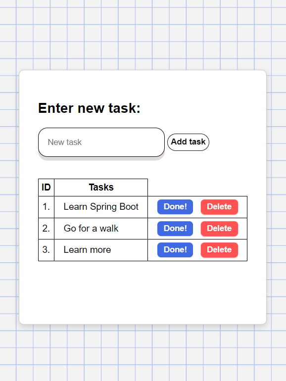

## 📃Simple To-Do App📃

- [A simple to-do app](http://....) built with Java 17, Spring Boot, Spring Data JPA, Thymeleaf, and MySQL.
- This project was created to practice Spring Data JPA and Testcontainers.

### Features:
- Add tasks to the list
- Delete tasks by ID
- Store tasks in the shared database

### Tests

- Implemented **unit tests** for the service layer (`TasksServiceTest`) with `JUnit5`, `Mockito` and `AssertJ`.
- Implemented **integration tests** (`TodoAppIntegrationTest`) that use `JUnit5`, `Spring Boot Test`, `MockMvc`, and `Testcontainers` for database.

### To run:

- `./mvnw spring-boot:run`
